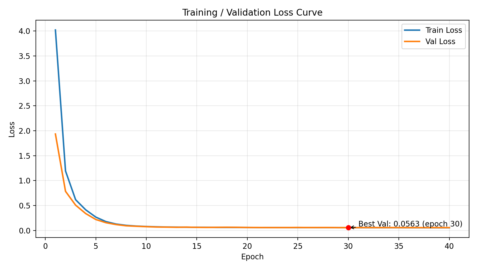
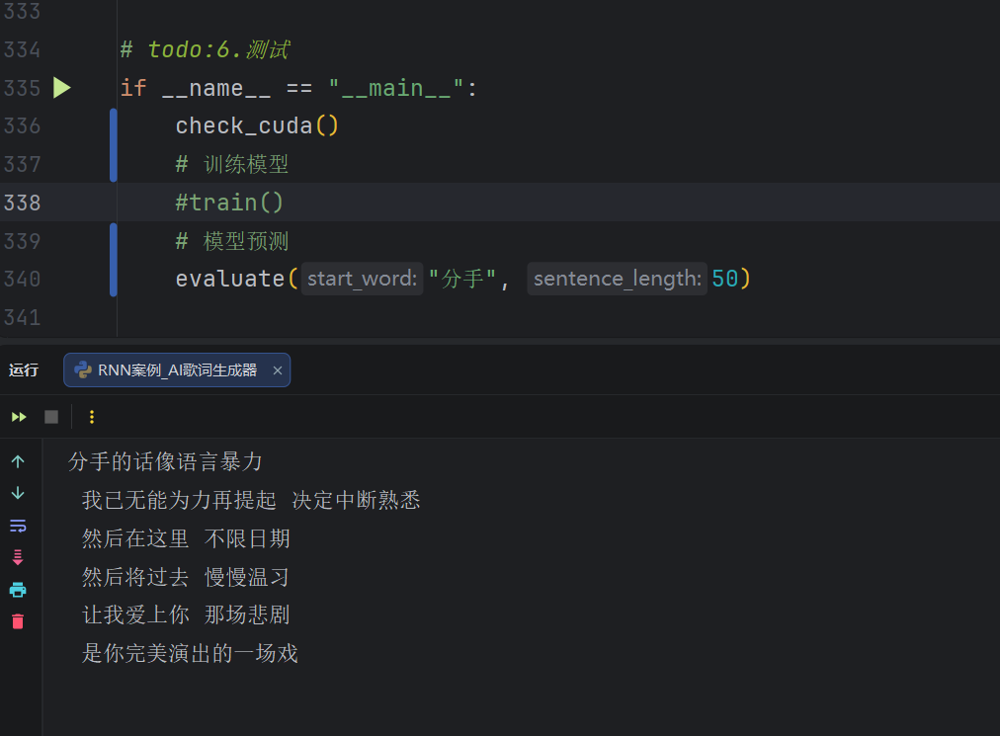
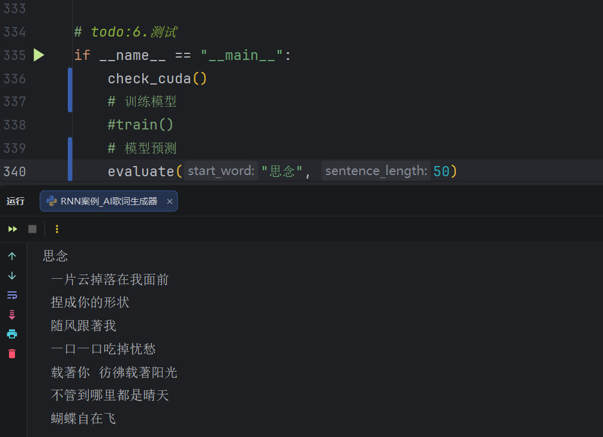
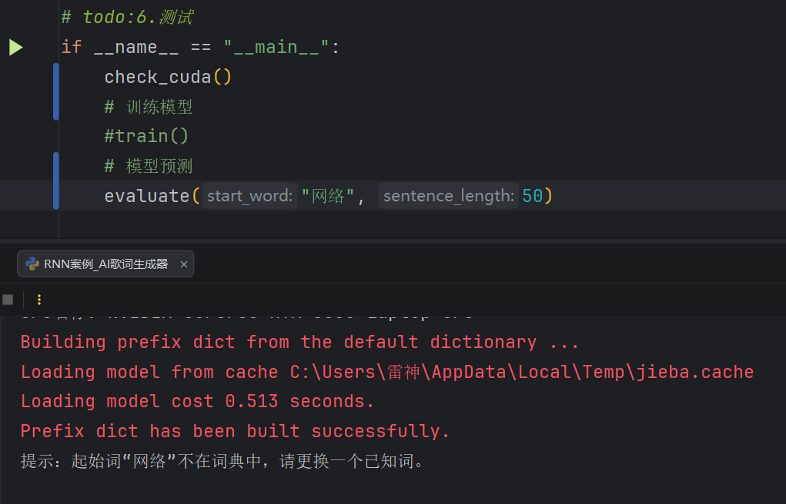

# JayChou Lyrics Generator 歌词生成器（RNN / GRU，PyTorch）

基于 **PyTorch** 在周杰伦歌词语料上训练一个文本生成模型，支持：

- 训练语料：`data/jaychou_lyrics.txt`
- 已训练模型权重：`model/text_model.pth`
- 训练可视化与生成样例：`可视化/`
- 训练与生成主程序：`gru_lyrics_generator.py`

---

## 结果展示（Results）

### 训练曲线（Training Curves）

  可以看到，随着训练的进行，训练损失和验证损失均迅速下降，并在后期趋于平稳，说明模型逐步收敛。整体来看，模型训练过程稳定，没有明显的过拟合现象。

### 生成样例（Generation Samples）
> 说明：以下为 2 个较成功样例 + 1 个失败样例（用于展示模型边界与常见问题）。  
> 生成属于采样式输出（受随机种子/temperature/top-k 等影响），同起始词可能生成不同文本。

| 成功案例 1 | 成功案例 2 |
| --- | --- |
|  |  |

**失败案例（边界示例）**：  


---

## 核心方法（Core Methods）

### 数据集与预处理
- 语料文件：`data/jaychou_lyrics.txt`
- 分词：使用 `jieba` 按行分词
- 特殊 token：
  - `<unk>`：未知词
  - `<sep>`：行分隔符（每行末尾追加，用于分段）

### Data Cleaning（数据清洗）

为了提升歌词生成质量、减少无意义 token，本项目在训练前对原始语料 `data/jaychou_lyrics.txt` 做了规则化清洗，主要包括：

- 移除非歌词元信息与标记：如 `END`、`music/MUSIC`、`rap/` 前缀、版权/来源提示等。
- 移除人名/署名等与生成目标无关的内容，避免模型在生成时插入“作者/艺人姓名”。
- 去除注释与舞台提示类文本：例如翻译说明、括注段落、特殊符号标记行等。
- 清理特殊符号与异常格式：例如 `☆` 前缀、`**`、方括号注释等，降低模型输出噪声字符的概率。
- 清理英文口癖与混入外语（如 `Coffee/tea/me` 等），使输出更偏向中文歌词风格。
- 清理过度重复标点（如 `……`、`。。`），让输出更整洁。

清洗目标是让模型尽可能学习“歌词正文”的语言模式，减少生成结果出现标签词、英文碎片、异常符号和与语义无关的噪声。

### 模型：TextGenerator（Embedding + GRU）
- 词向量：`Embedding(vocab_size, 128)`
- 主体：`GRU(128 -> 256, num_layers=1, batch_first=True)`
- 输出：`Linear(256 -> vocab_size)`（逐 token 预测下一个 token）

### 训练策略（Training Setup）
- 损失函数：`CrossEntropyLoss`
- 优化器：`Adam(lr=1e-3)`
- 学习率调度：`ReduceLROnPlateau(factor=0.5, patience=4)`
- 稳定训练：
  - 梯度裁剪：`clip_grad_norm_(max_norm=1.0)`
  - Early Stopping（patience=10，按验证集 loss）
- 训练/验证拆分：按 9:1 切分，并固定随机种子保证可复现

### 生成策略（Sampling Strategy）
- 采样方式：使用采样式生成（非贪心 `argmax`），在保证质量的同时增加多样性。
- 温度缩放（temperature）：`0.7`。用于控制随机性；值越大越“发散”，值越小越“保守”。
- Top-k 采样（top_k）：`12`。每一步只在概率最高的 k 个候选 token 中进行采样，减少低质量 token 被选中的概率。
- 重复惩罚（repetition_penalty）：`1.15`。对近期已生成 token 降低再次被采样的概率，缓解“复读机”现象。

---

## 模型优化过程说明（阶段记录）
本项目最初使用经典 `nn.RNN` 完成“下一词预测”，在能够跑通流程的基础上，逐步针对 **长程依赖、训练稳定性与生成质量** 做了迭代优化，最终形成当前的 GRU + 采样策略方案。

### 阶段 1：经典 RNN 基线版本（Baseline）

- 模型结构：`Embedding -> nn.RNN -> Linear`
- 数据处理：
  - 逐行 `jieba` 分词后拼接成长序列
  - 以空格 `' '` 作为行间分隔（对语料有“必须包含空格 token”的隐式依赖）
- 训练方式：
  - 单一训练集循环训练（无验证集、无早停、无学习率调度）
  - 隐状态初始化固定 batch_size（代码里写死为 5）
- 生成方式：
  - 直接 `argmax`（贪心解码）选取下一 token
  - 容易出现“重复、单调、缺乏多样性”，并且一旦早期 token 选错，后续会快速跑偏

**阶段结论：**
可以快速搭建端到端流程，但在歌词这种长文本生成任务上，经典 RNN 更容易出现梯度消失/记忆不足，生成结果也更偏“复读/模板化”。

---

### 阶段 2：模型升级为 GRU（改善长程依赖与收敛）

- 将核心循环单元从 `nn.RNN` 替换为 `nn.GRU`：
  - GRU 通过门控机制缓解长序列训练中的梯度问题
  - 在相近参数量下通常比经典 RNN 更稳定、更能记住更长的上下文
- 同时将网络设置为更符合“批量序列建模”的形式：
  - 使用 `batch_first=True`（输入输出维度更直观：`[batch, seq, feature]`）
  - 输出层按每个时间步对词表做分类（`[batch, seq, vocab]`），与目标序列天然对齐

---

### 阶段 3：训练流程工程化（稳定性与可复现性）

- 固定随机种子（Python / NumPy / CUDA），提升结果可复现性
- 训练/验证集切分（约 9:1），用验证集 loss 监控泛化
- 学习率调度：`ReduceLROnPlateau`（验证集停滞时自动降低 lr）
- Early Stopping（patience=10），避免无效训练与过拟合
- 梯度裁剪（`max_norm=1.0`），提升 RNN/GRU 类模型训练稳定性
- 保存 checkpoint（权重 + 词表/映射），避免推理时出现“训练/推理词表不一致”的隐患

---

### 阶段 4：生成策略从“贪心”到“采样”（显著提升可读性与多样性）
经典版本使用 `argmax` 直接取最大概率 token，优点是确定性强，但会牺牲创造性，且更容易陷入重复。
当前版本改为 **温度采样 + top-k + 重复惩罚 + 多候选筛选**：
- 通过温度与 top-k 控制“随机性与质量”的平衡
- 通过 repetition penalty 降低近期 token 被反复采样的概率，缓解复读
- 通过多候选生成并按平均 log prob 选优，提升整体稳定性

---

### 总结
- 性能与质量提升的关键来源于两点：
  1) **模型结构升级（RNN → GRU）**：提升长程依赖建模能力与训练稳定性  
  2) **训练与生成策略协同优化**：通过验证集驱动训练 + 更合理的采样策略，减少跑偏与复读

---

## 环境与安装（Environment & Installation）
- Python 3.8+（建议）
- 依赖安装：

```bash
pip install -r requirements.txt
```

> 提示：`torch` 在不同平台（CPU/CUDA）安装方式不同。如安装遇到问题，建议按 PyTorch 官方指引选择对应版本。  
> 我的环境参考：Windows + `torch 2.7.1+cu118`，`jieba 0.42.1`，`numpy 1.26.4`。

---

## 可复现性说明（Reproducibility）
- 语料已包含：`data/jaychou_lyrics.txt`
- 已训练权重已包含：`model/text_model.pth`
- 因生成采用采样策略，输出会有一定随机性。

---

## 快速开始（Quick Start）

### 1) 直接生成（默认）
运行：

```bash
python gru_lyrics_generator.py
```

默认会调用：

```python
evaluate("雨下", 50)
```

### 2) 训练（可选）
在 `gru_lyrics_generator.py` 主入口中将：

```python
#train()
```

改为：

```python
train()
```

然后运行：

```bash
python gru_lyrics_generator.py
```

训练完成后会保存到：

- `model/text_model.pth`

---

## 项目结构（Project Structure）
```text
.
├─ data/
│  └─ jaychou_lyrics.txt
├─ model/
│  └─ text_model.pth
├─ 可视化/
│  ├─ loss_curve.png
│  ├─ 测试样例1.png
│  ├─ 测试样例2.png
│  └─ 测试样例3.png
├─ gru_lyrics_generator.py
├─ requirements.txt
├─ README.md
├─ LICENSE
└─ .gitignore
```

---

## 说明（Notes）
- 代码会自动选择设备：有 CUDA 则用 GPU，否则用 CPU。
- 起始词必须在词典中，否则会提示“起始词不在词典中”。

---

## License
MIT License（见 `LICENSE`）。
